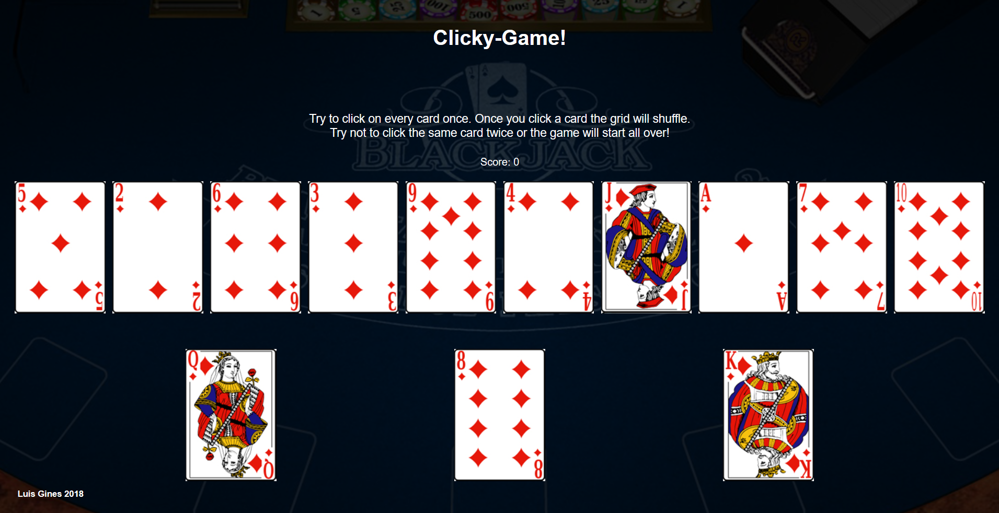

# Clicky Game
Clicky Game is a memory game built using React.

Click me to play a live demo [Demo](https://clicky-game-aces.herokuapp.com/)

## Technologies Used
- [x] ES6, Node, React

## How to Run
To run Clicky Game you will need [Bash](https://git-scm.com/downloads/), [Node](https://nodejs.org/en/), [npm](https://www.npmjs.com/get-npm?utm_source=house&utm_medium=homepage&utm_campaign=free%20orgs&utm_term=Install%20npm), and [React](https://reactjs.org/).

1. In Bash, to clone the repo type `git clone repo-link-here` to download Clicky Game.

2. Then, type `cd directory-of-clicky-folder; npm install` to download the required packages.

4. In Bash, type `yarn start` to start the React app.

## Demo - Interface

1. The application renders different images to the screen. 

2. The application keeps track of the user's score and is incremented when clicking an image for the first time. 

3. The user's score is be reset to 0 if they click the same image more than once.

4. Every time an image is clicked, the images rendered to the page are shuffledvin a random order.

5. Once the user's score is reset after an incorrect guess, the game should restart.

